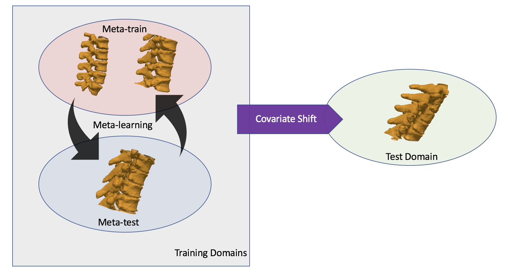

# Domain Generalizer: A Few-shot Meta Learning Framework for Domain Generalization in Medical Imaging

PyTorch code of our MICCAI 2020 paper [Domain Generalizer: A Few-shot Meta Learning Framework for Domain Generalization in Medical Imaging](https://arxiv.org/abs/2008.07724) to be presented at [Domain Adaptation and Representation Transfer (DART) 2020](https://sites.google.com/view/dart2020)

Authors: [Pulkit Khandelwal](https://pulkit-khandelwal.github.io/) and [Paul A. Yushkevich](http://picsl.upenn.edu/people/faculty-staff/paul-yushkevich/)

Affiliations:
  - Department of Bioengineering, University of Pennsylvania, Philadelphia, PA, United States
  - Penn Image Computing and Science Laboratory, Department of Radiology, University of Pennsylvania, Philadelphia, PA, United States

Contact: pulks@seas.upenn.edu



### Abstract
Deep learning models perform best when tested on target (test) data domains whose distribution is similar to the set of source (train) domains. However, model generalization can be hindered when there is significant difference in the underlying statistics between the target and source domains. In this work, we adapt a domain generalization method based on a model-agnostic meta-learning framework to biomedical imaging. The method learns a domain-agnostic feature representation to improve generalization of models to the unseen test distribution. The method can be used for any imaging task, as it does not depend on the underlying model architecture. We validate the approach through a computed tomography (CT) vertebrae segmentation task across healthy and pathological cases on three datasets. Next, we employ few-shot learning, i.e. training the generalized model using very few examples from the unseen domain, to quickly adapt the model to new unseen data distribution. Our results suggest that the method could help generalize models across different medical centers, image acquisition protocols, anatomies, different regions in a given scan, healthy and diseased populations across varied imaging modalities.

### Code
- `mldg-seg` folder consists is the main directory for all the PyTorch code for the procedures and experiments
- `postprocess` folder consists of code for inference, computing the evaluation metrics, statistics, retaining the largest connected component, and tsne plots
- `data_split_up` folder consists of all the domain splits
- `requirementst.txt` contains the majority of the libraries used


### References

- The current work is inspired by: [Learning to Generalize: Meta-Learning for Domain Generalization](https://arxiv.org/pdf/1710.03463.pdf)

- For a comprehensive overview of CT vertebrae segmentation look at the paper: [Spine and Individual Vertebrae Segmentation in Computed Tomography Images Using Geometric Flows and Shape Priors](https://www.frontiersin.org/articles/10.3389/fcomp.2021.592296/full) or MSc thesis: [Spine segmentation in computed tomography images using geometric flows and shape priors](https://escholarship.mcgill.ca/concern/theses/4b29bb21t) by Pulkit Khandelwal, and supervised by [Prof. Kaleem Siddiqi](http://www.cim.mcgill.ca/~siddiqi/) and [Prof. D. Louis Collins](http://nist.mni.mcgill.ca/) at McGill University.

- See paper for the complete list of references.

- Code:
  - Code adapted and inspired from: [Learning to Generalize: Meta-Learning for Domain Generalization](https://github.com/HAHA-DL/MLDG) 
  - Unet architecture, losses at [pytorch-3dunet](https://github.com/wolny/pytorch-3dunet) 
  - Post-processing and miscellaneous functions [MIC-DKFZ/nnUNet](https://github.com/MIC-DKFZ/nnUNet) 
  - Data Augmentation [image_tools](https://github.com/fcalvet/image_tools)


### Citing the work

```
@misc{kh2020domain,
    title={Domain Generalizer: A Few-shot Meta Learning Framework for Domain Generalization in Medical Imaging},
    author={Pulkit Khandelwal and Paul Yushkevich},
    year={2020},
    eprint={2008.07724},
    archivePrefix={arXiv},
    primaryClass={cs.CV}
}
```
